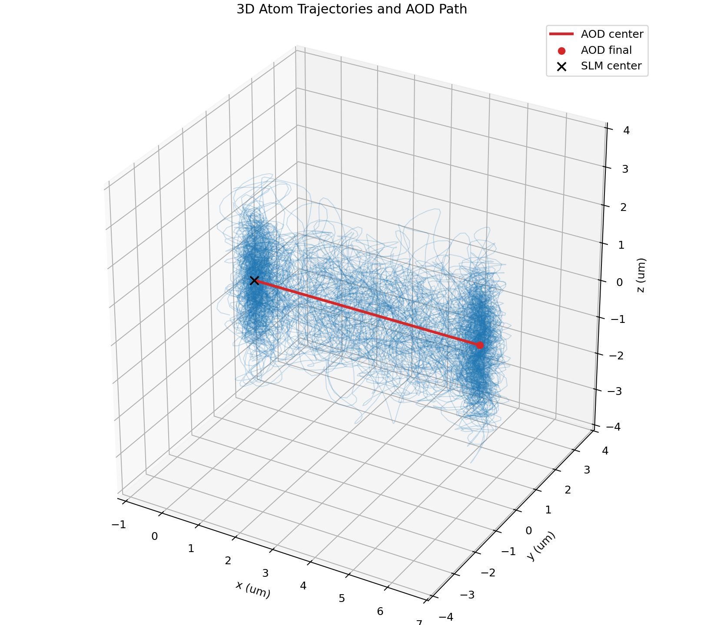

# atom_classical_mc

Classical Monte Carlo tools for estimating Rb87 heating and loss during
time-dependent optical tweezer transfer.



The core library lives directly in `src/`. See `doc/plan.md` for the model
assumptions and public API.

Run the concrete SLM-to-AOD transfer example with:

```bash
python3 example/slm_to_aod_transfer.py
```

Install the optional plotting dependency and use `--plot` or `--save-plot` for
2D diagnostics. The example writes separate suffixed figures: `_traj` for
trajectory/ramp geometry and `_energy` for heating/loss/motional occupation
distributions.
Use `--plot-3d` or `--save-3d-plot` for the standalone 3D atom trajectory and
AOD center path view.

The example also prints harmonic radial/axial trap frequencies and motional
occupation estimates for atoms decomposed in the initial SLM trap and final AOD
trap basis.

By default, the simulator rejects and resamples atoms that are already unbound
in the initial trap, so reported loss is conditioned on successful initial
loading.

Compare AOD position ramp profiles with:

```bash
python3 example/slm_to_aod_transfer.py --compare-position-ramps --save-comparison-plot example/position_ramp_compare.png
```

The default comparison includes linear, cubic smoothstep, quintic minimum-jerk,
and sinusoidal ramps with the same trap depths, timing, and random seed.
