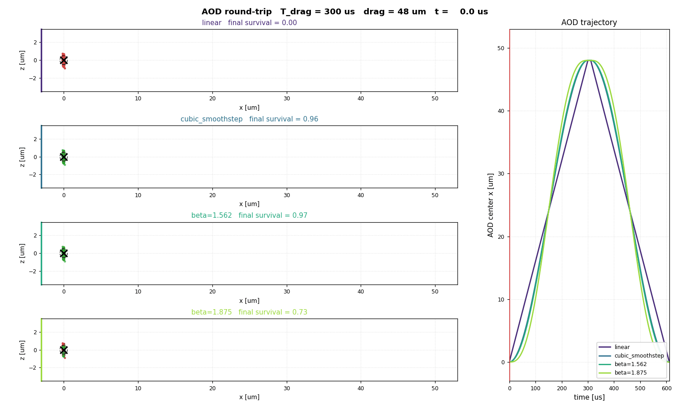
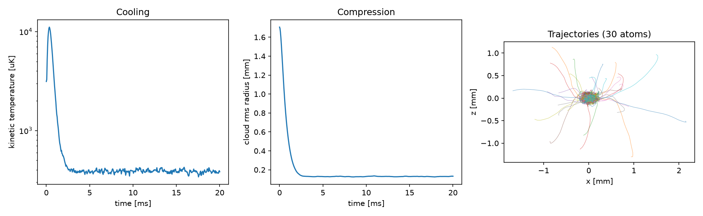

# atom_classical_mc

Classical Monte Carlo tools for estimating Rb87 heating and loss during
time-dependent optical tweezer transfer.


Different trajectories comparison:



The core library lives directly in `src/`. See `doc/plan.md` for the model
assumptions and public API.

Run the concrete SLM-to-AOD transfer example with:

```bash
python3 example/slm_to_aod_transfer.py
```

The example writes separate suffixed figures: `_traj` for trajectory/ramp
geometry, `_energy` for heating/loss/motional occupation distributions, and
`_3d` for the atom trajectories with the AOD center path.

The example also prints harmonic radial/axial trap frequencies and motional
occupation estimates for atoms decomposed in the initial SLM trap and final AOD
trap basis.

By default, the simulator rejects and resamples atoms that are already unbound
in the initial trap, so reported loss is conditioned on successful initial
loading.

## Magneto-optical trap (MOT) simulation

The `src/mot.py` pipeline couples an internal-state backend (steady-state,
rate-equation, or stochastic-jump populations of the effective two-level
cycling transition) with a momentum backend (per-photon recoil kicks plus
optional conservative traps). Magnetic fields, laser beams, and species
data (Rb85/Rb87 D2) are configurable; see `doc/mot_plan.md` for the model.

Run the Rb85 MOT capture-and-cooling example with:

```bash
python3 example/mot/rb85_mot.py --save-plot
```



Compare AOD position ramp profiles with:

```bash
python3 example/position_ramp_compare.py
```

The default comparison includes linear, cubic smoothstep, quintic minimum-jerk,
and sinusoidal ramps with the same trap depths, timing, and random seed. It uses
a moderately shallow AOD depth so the default plot shows nonzero transfer
errors instead of a saturated all-survive case. It
plots ramp shape, `1 - p` transfer error, and temperature gain. Edit the
constants at the top of the script to change the compared profiles or output path.
