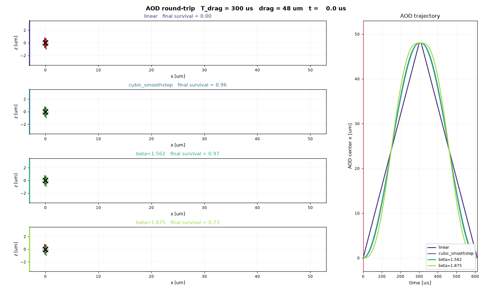

# atom_classical_mc

Classical Monte Carlo multiphysics simulator for cold atoms: an ensemble of classical point atoms evolved under composable physics modules — optical tweezers (static, moving, astigmatic, gridded), magnetic (Zeeman) potentials,
optical dipole beams, and near-resonant photon scattering with internal-state dynamics (a MOT is one configuration of it, not a special case).


The core library lives in the `atommc/` package. In the spirit of a
COMSOL-style multiphysics model, a simulation is an `AtomSystem` — a species
plus a list of physics modules — handed to the `simulate` driver:

```python
from atommc import (
    AtomSystem, SimulationConfig, simulate, RB85_D2,
    ZeemanPotential, LightScattering, LightMatterSystem,
    QuadrupoleMagneticField, six_beam_mot, gauss_per_cm, ms,
)

quad = QuadrupoleMagneticField(gradient_T_per_m=gauss_per_cm(10.0))
system = AtomSystem(species=RB85_D2, modules=[
    ZeemanPotential.for_sublevel(quad, g_f=1/3, m_f=3),          # magnetic force
    LightScattering(LightMatterSystem(                            # radiation pressure
        species=RB85_D2, beams=six_beam_mot(detuning_hz=-9.1e6,
        saturation=2.0), magnetic_fields=[quad])),
])
result = simulate(system, SimulationConfig(
    initial_temperature_uK=3000.0, initial_cloud_sigma_m=1e-3,
    timestep_s=5e-8, duration_s=ms(5.0), ensemble_size=400,
))
```

Modules come in two kinds (see `atommc/physics/base.py`): `ConservativeForce`
(potential/force/Hessian — traps, Zeeman potentials, dipole beams) and
`StochasticProcess` (per-step velocity kicks with opaque per-atom state —
photon scattering, future collisions). The driver never special-cases any
physics; new modules plug in without touching the loop. See `doc/plan.md` for
the tweezer model, `doc/light_matter_plan.md` for the scattering model, and
`doc/multiphysics_plan.md` for the module architecture; `atommc/README.md` is
a one-line index of every function in the package.

## Examples

Optical tweezer transfer (SLM to moving AOD trap):

```bash
python3 example/aod/slm_to_aod_transfer.py
```

The example writes separate suffixed figures into `example/aod/render/`:
`_traj` for trajectory/ramp geometry, `_energy` for heating/loss/motional
occupation distributions, and `_3d` for the atom trajectories with the AOD
center path. (`example/aod/transfer_animation.py` renders the same transfer
as a GIF.) It also prints harmonic radial/axial trap frequencies and motional
occupation estimates for atoms decomposed in the initial SLM trap and final
AOD trap basis.

By default, the simulator rejects and resamples atoms that are already unbound
in the initial trap, so reported loss is conditioned on successful initial
loading.

`example/aod/ramp_compare.py` (`--gif`) sweeps the position-ramp shape of a
moving-AOD drag and reports how the profile trades off peak velocity against
heating and survival:



Near-resonant light forces (MOT, molasses, probe beams):

```bash
python3 example/mot/rb85_mot.py --save-plot
```

This writes the summary figure to `example/mot/render/rb85_mot_summary.png`
(add `--gif` for an animated cooling-cloud GIF alongside it).
`example/mot/mmwave_mot.py` loads a tri-sector grating MOT from a 600 K
effusive beam; `example/tweezer_probe_heating.py` shows the mixed case —
recoil heating of a tweezer-trapped atom.

Magnetic and dipole potentials (the newest modules):

```bash
python3 example/magnetic_dipole/quadrupole_and_dipole.py
```

This holds an Rb87 |F=2, m_F=2> cloud in a bare quadrupole magnetic trap
(and expels the anti-trapped sublevel), then builds an 850 nm dipole tweezer
from power/waist/wavelength and cross-checks it against an equivalent
hand-tuned `GaussianTrap`.
